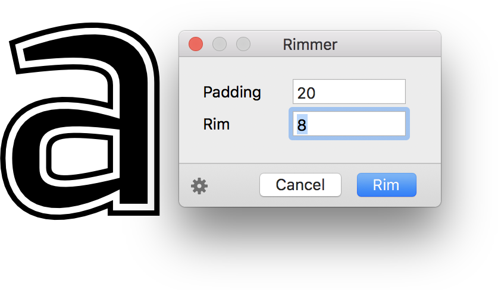

# Rimmer

This is a plugin for the [Glyphs font editor](http://glyphsapp.com/) by Georg Seifert.
It adds rims around your glyphs. After installation, it will add the menu item *Filter > Rimmer*.
You can set a keyboard shortcut in System Preferences.

### Installation

1. Go to *Window > Plugin Manager.*
2. Click on the *Install* button next to *Rimmer.*
3. Restart the app.

### Usage Instructions

1. Select a glyph in Edit view, or select any number of glyphs in Font or Edit View.
2. Choose *Filter > Rimmer*.

Alternatively, you can also use it as a custom parameter. Click on the gear menu in the lower left to copy such a parameter into the clipboard. Paste it into the custom parameters of an instance.

At the end of the parameter value, you can hang `exclude:` or `include:`, followed by a comma-separated list of glyph names. This will apply the filter only to the included glyphs, or the glyphs not excluded, respectively.

### Requirements

The plugin has only been tested for Glyphs 2.5.x on macOS Sierra. It may not work on older configurations.

### License

Copyright 2018 Rainer Erich Scheichelbauer (@mekkablue).
Based on sample code by Georg Seifert (@schriftgestalt) and Jan Gerner (@yanone).

Licensed under the Apache License, Version 2.0 (the "License");
you may not use this file except in compliance with the License.
You may obtain a copy of the License at

http://www.apache.org/licenses/LICENSE-2.0

See the License file included in this repository for further details.
